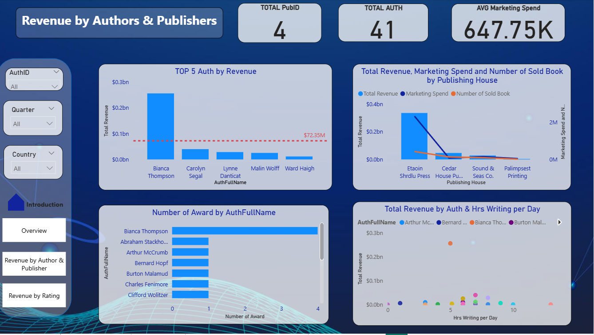

# 📚 Book Revenue Analysis – Power BI Dashboard

An interactive **Power BI dashboard** built to analyze **book sales performance**, supporting data-driven business decisions.

---

## 🔍 Project Overview

This project focuses on analyzing book sales data using **Power BI** to uncover key insights related to revenue growth, product performance, and customer behavior.  
The dashboard is designed for **business users**, enabling quick exploration and effective decision-making.

---

## 🎯 Objectives

- Analyze overall **revenue and sales trends**
- Identify **top-performing books and genres**
- Understand **customer purchasing patterns**
- Support strategic decisions for sales and marketing teams

---

## 📊 Dashboard Preview

### 🔹 Overall Performance

### 🔹 Revenue by Authors and Publishers

### 🔹 Revenue by Ratings

---

## 🛠 Tools & Skills

- **Power BI**
- Data Modeling & Relationships
- **DAX** (Measures & Calculated Columns)
- Power Query (Data Cleaning & Transformation)
- Data Visualization & Dashboard Design

---

## 🧩 Key Features

- Interactive filters by **time, genre, author, and publisher**
- KPI cards for **Total Revenue, Sales Volume, Orders**
- Trend analysis for monitoring business performance
- Clear and intuitive dashboard layout for non-technical users

---

## 💡 Key Insights

- A small number of genres contribute the majority of total revenue
- Sales show clear seasonal patterns across months
- Award-winning books generate significantly higher revenue
- Top authors and publishers dominate overall sales performance

---

## 📁 Repository Structure
├── Bookshop_Revenue_Dashboard.pbix
├── images/
│ ├── overview.png
│ ├── Revenue by Authors and Publishers.png
│ └── Revenue by Ratings.png
└── README.md

---

## 🚀 How to Use

1. Download the `.pbix` file from this repository  
2. Open it using **Power BI Desktop**
3. Use filters and slicers to explore the dashboard interactively

---

## 👤 Author

**Trịnh Giang**  
Aspiring **Data Analyst Intern**
